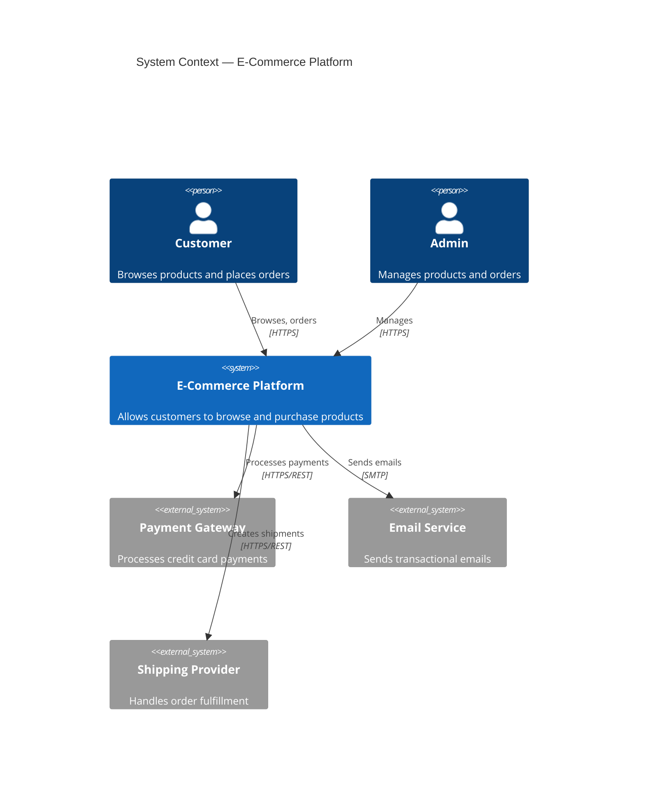
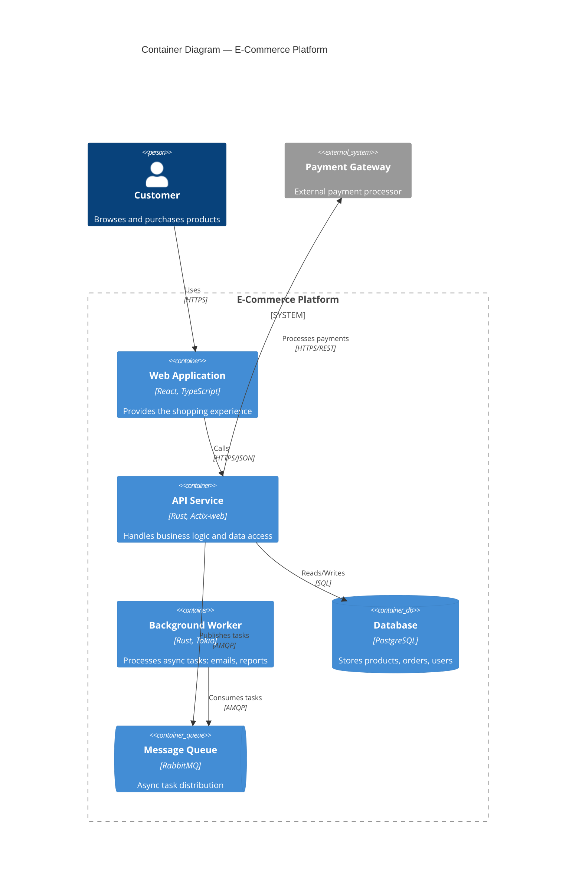
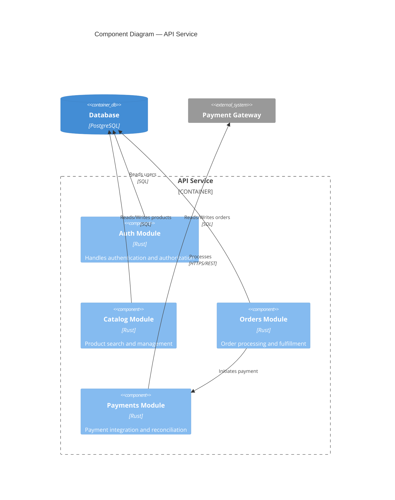
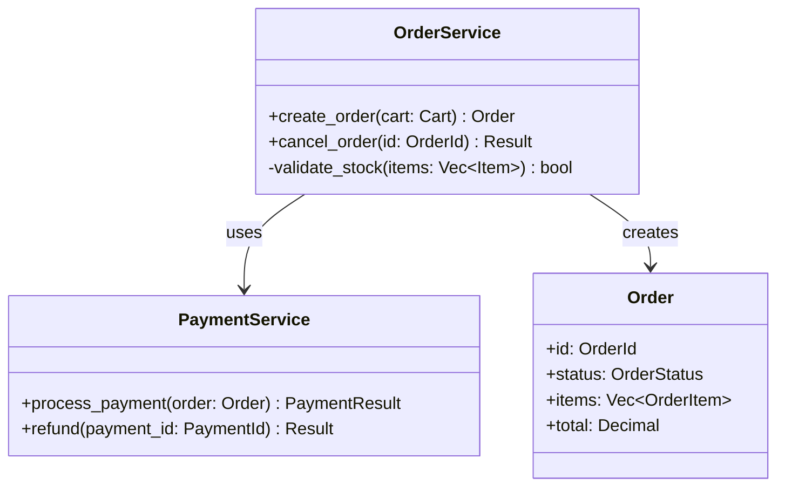

# C4 模型图指南

> 本指南介绍如何在 StrayMark 文档中使用 C4 模型的 Mermaid 语法，特别是在 ADR（架构决策记录）文档中。

**语言**: [English](../../C4-DIAGRAM-GUIDE.md) | [Español](../es/C4-DIAGRAM-GUIDE.md) | 简体中文

---

## 什么是 C4 模型？

C4 模型（Context、Containers、Components、Code）是一组用于在不同缩放级别可视化软件架构的抽象。由 Simon Brown 创建，它为描述和传达架构提供了一致的词汇表。

每个级别深入上一级别：

| 级别 | 展示内容 | 在 StrayMark 中的使用场景 |
|------|----------|--------------------------|
| **1. Context** | 系统 + 用户 + 外部系统 | 系统级决策的 ADR，高层需求的 REQ |
| **2. Container** | 应用、数据库、服务 | 服务架构的 ADR，部署决策 |
| **3. Component** | 容器内的内部模块 | 模块级决策的 ADR，重大重构的 AILOG |
| **4. Code** | 类、接口、函数 | 在 StrayMark 中很少需要 — 仅用于关键设计模式 |

---

## 级别 1：系统上下文

展示谁使用系统以及系统与哪些外部系统交互。



### 关键元素

| 元素 | 语法 | 描述 |
|------|------|------|
| 人员 | `Person(id, "Name", "Description")` | 用户或角色 |
| 系统 | `System(id, "Name", "Description")` | 被记录的系统 |
| 外部系统 | `System_Ext(id, "Name", "Description")` | 外部依赖 |
| 关系 | `Rel(from, to, "Label", "Technology")` | 通信流 |

---

## 级别 2：容器

深入系统内部，展示高层技术选择：应用、数据存储以及它们之间的通信方式。



### 关键元素

| 元素 | 语法 | 描述 |
|------|------|------|
| 边界 | `System_Boundary(id, "Name") { ... }` | 对容器进行分组 |
| 容器 | `Container(id, "Name", "Tech", "Description")` | 应用或服务 |
| 数据库 | `ContainerDb(id, "Name", "Tech", "Description")` | 数据存储 |
| 队列 | `ContainerQueue(id, "Name", "Tech", "Description")` | 消息队列 |

---

## 级别 3：组件

深入单个容器，展示其内部组件。



### 关键元素

| 元素 | 语法 | 描述 |
|------|------|------|
| 边界 | `Container_Boundary(id, "Name") { ... }` | 在容器内对组件进行分组 |
| 组件 | `Component(id, "Name", "Tech", "Description")` | 内部模块或包 |

---

## 级别 4：代码

展示类、接口及其关系。在 StrayMark 中**很少需要** — 仅用于需要记录的关键设计模式。

对于代码级别的图，使用标准 Mermaid 类图而非 C4：



---

## PlantUML 替代方案

对于偏好使用 PlantUML 的团队，可以使用 [C4-PlantUML](https://github.com/plantuml-stdlib/C4-PlantUML) 库获取等效语法。

### Context（PlantUML）

```plantuml
@startuml
!include https://raw.githubusercontent.com/plantuml-stdlib/C4-PlantUML/master/C4_Context.puml

Person(customer, "Customer", "Browses and purchases")
System(ecommerce, "E-Commerce Platform", "Shopping platform")
System_Ext(payment, "Payment Gateway", "Processes payments")

Rel(customer, ecommerce, "Uses", "HTTPS")
Rel(ecommerce, payment, "Processes payments", "REST")
@enduml
```

### Container（PlantUML）

```plantuml
@startuml
!include https://raw.githubusercontent.com/plantuml-stdlib/C4-PlantUML/master/C4_Container.puml

Person(customer, "Customer")
System_Boundary(c1, "E-Commerce Platform") {
    Container(webapp, "Web App", "React", "UI")
    Container(api, "API", "Rust", "Business logic")
    ContainerDb(db, "Database", "PostgreSQL", "Data store")
}

Rel(customer, webapp, "Uses", "HTTPS")
Rel(webapp, api, "Calls", "JSON/HTTPS")
Rel(api, db, "Reads/Writes", "SQL")
@enduml
```

---

## 与 StrayMark 文档的集成

### 在 ADR 文档中

当决策涉及以下情况时，在 `## Architecture Diagram` 部分添加 C4 图：
- 引入或移除系统、服务或数据存储
- 更改服务间通信模式
- 修改系统边界或部署拓扑

### 在 REQ 文档中

使用级别 1（Context）图来说明：
- 谁与系统交互
- 涉及哪些外部系统
- 高层数据流

### 选择合适的级别

| 决策范围 | C4 级别 | 示例 |
|----------|---------|------|
| "我们将集成 Stripe 进行支付" | Context | 新的外部系统 |
| "我们将把单体架构拆分为微服务" | Container | 新的服务架构 |
| "我们将把认证模块提取为独立模块" | Component | 内部重构 |
| "我们将使用策略模式进行定价" | Code（类图） | 设计模式 |

---

## 参考资料

- [C4 Model — Simon Brown](https://c4model.com/)
- [Mermaid C4 Diagrams](https://mermaid.js.org/syntax/c4.html)
- [C4-PlantUML](https://github.com/plantuml-stdlib/C4-PlantUML)

---

*StrayMark fw-4.34.0 | [Strange Days Tech](https://strangedays.tech)*
