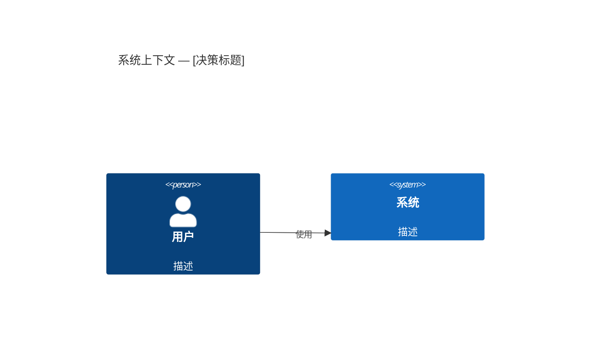

# ADR: [架构决策标题]

## 状态

[draft | accepted | deprecated | superseded]

**注意**：本文档由 AI 代理创建，需要人工审查。

> **不可变性规则**：ADR 一旦达到 `accepted` 状态，则不得修改。如果决策发生变更，请创建一份新的 ADR，并在其前置元数据中设置 `supersedes: ADR-YYYY-MM-DD-NNN`。原始 ADR 的状态将变更为 `superseded`。

## 背景

[描述技术和业务背景。哪些因素在起作用（技术、政策、社会、项目相关）。语言应保持中立，仅描述事实。]

## 决策

[描述架构决策及其理由。使用主动语态："我们将使用……"、"我们将实现……"]

## 考虑过的替代方案

### 1. [替代方案 1]
- **描述**: [内容是什么]
- **优点**: [优势]
- **缺点**: [劣势]
- **未采用原因**: [放弃的理由]

### 2. [替代方案 2]
- **描述**: [内容是什么]
- **优点**: [优势]
- **缺点**: [劣势]
- **未采用原因**: [放弃的理由]

## 后果

> 根据相关的 ISO/IEC 25010:2023 质量特性评估后果。
> 完整质量模型请参阅 `00-governance/ISO-25010-2023-REFERENCE.md`。

### 正面影响
- [收益 1]
- [收益 2]

### 负面影响
- [成本或权衡 1]
- [成本或权衡 2]

### 中性影响
- [既非明显正面也非负面的后果]

### 质量影响评估

> 仅填写受此决策影响的质量特性。

| 质量特性 (ISO 25010:2023) | 影响 | 描述 |
|--------------------------|------|------|
| 功能适宜性 | [+/-/~] | [此决策如何影响功能覆盖、正确性或适当性] |
| 性能效率 | [+/-/~] | [对时间行为、资源利用或容量的影响] |
| 兼容性 | [+/-/~] | [对共存性或互操作性的影响] |
| 交互能力 | [+/-/~] | [对可学习性、可操作性、包容性等的影响] |
| 可靠性 | [+/-/~] | [对无故障性、可用性、容错性或可恢复性的影响] |
| 安全性 | [+/-/~] | [对机密性、完整性、真实性或抗攻击性的影响] |
| 可维护性 | [+/-/~] | [对模块化、可分析性、可修改性或可测试性的影响] |
| 灵活性 | [+/-/~] | [对适应性、可安装性或可扩展性的影响] |
| 安全防护 | [+/-/~] | [对操作约束、故障安全、危险警告或安全集成的影响] |

> **图例**：`+` = 正面影响，`-` = 负面影响，`~` = 中性/权衡。删除不适用的行。

## 受影响的组件

| 组件 | 变更类型 | 影响程度 |
|------|---------|---------|
| [组件 1] | [新增/修改/移除] | [高/中/低] |
| [组件 2] | [新增/修改/移除] | [高/中/低] |

## 实施计划

1. [步骤 1]
2. [步骤 2]
3. [步骤 3]

## 成功指标

- [如何判断决策是否正确]
- [需要监控哪些指标]

## 验证标准

> 定义可衡量的标准来评估此决策是否正确。

| 指标 | 目标值 | 测量方法 | 时间线 |
|------|-------|---------|--------|
| [例如：响应时间] | [例如：< 200ms] | [例如：p95 负载测试] | [例如：部署后 30 天] |
| [指标 2] | [目标值] | [方法] | [时间线] |

## 架构图

> 当此决策涉及架构变更时，请包含适当层级的 C4 图。
> 语法参考请参阅 `00-governance/C4-DIAGRAM-GUIDE.md`。

> **指导**：系统级决策使用 `C4Context`，服务/容器级决策使用 `C4Container`，内部模块决策使用 `C4Component`。如不需要架构图，请删除本节。

## 参考资料

- [相关文档链接]
- [参考的论文、文章或资源]

---

## 修订历史

| 日期 | 作者 | 变更内容 |
|------|------|---------|
| YYYY-MM-DD | [agent/human] | 初始创建 |

<!-- Template: StrayMark | https://strangedays.tech -->
