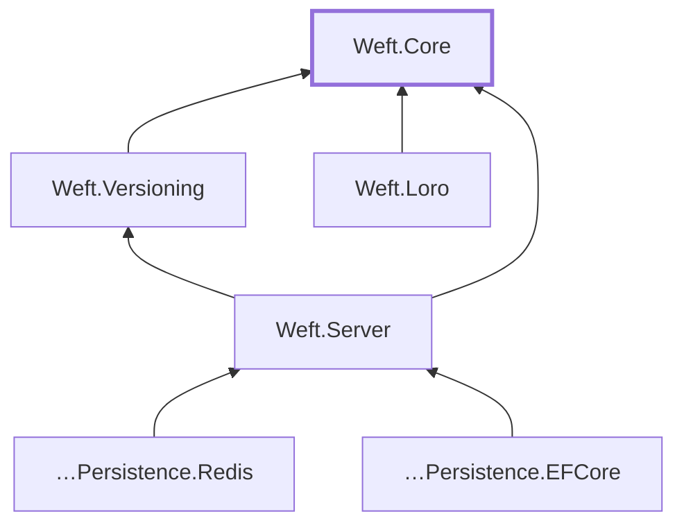

# Weft architecture

> How Weft is built and why. An orientation document for anyone about to consume the library,
> integrate it, or contribute to it.
>
> **Scope**: this doc explains the **shape** of the system and the **memory contract** of the native
> boundary. It does not duplicate what already lives elsewhere: the per-package API is in
> [`docs/api/README.md`](api/README.md), the formal contracts in
> [`specs/001-weft-crdt-versioning/contracts/`](../specs/001-weft-crdt-versioning/contracts/), and the
> *why* of each technical decision in
> [`research.md`](../specs/001-weft-crdt-versioning/research.md) (R1–R17), which is linked to rather
> than re-explained.

## What Weft is

Weft is a **building block**, not an application: it gives .NET applications real-time CRDT
collaboration and content-addressed versioning. The actual CRDT work is done by
[`yrs`](https://github.com/y-crdt/y-crdt) (the Rust core of Yjs); Weft adds a safe binding, a
versioning model that `yrs` doesn't have, a relay compatible with the Yjs ecosystem, and the
memory/determinism discipline that makes all of that sustainable from .NET.

Two design consequences worth having clear from the start:

- **Weft does not decide your authentication, your storage, or your retention.** The relay delegates
  authorization to an `IWeftAuthorizer` of yours (R17), persistence to an `IDocumentStore` of yours
  (R8), and published versions are immutable with no `delete` in v1 — retention policy is the
  consumer's domain.
- **Interoperability with Yjs is a requirement, not an accident.** The wire is the y-sync protocol
  over lib0 (R7) and the encoding is byte-identical to Yjs JS, verified by a blocking gate. An
  existing Tiptap/y-websocket client talks to Weft with no adapters.

## Module map

Six packages. All dependencies point **toward the core**; none the other way. Each arrow reads
*depends on*.



| Package | Responsibility | Depends on |
| --- | --- | --- |
| **Weft.Core** | Safe binding to `yrs` via an in-house C-ABI shim; abstractions (`ICrdtEngine`, `ICrdtDoc`); serialized concurrency (`DocumentBroker`) | — |
| **Weft.Versioning** | **Engine-agnostic** content-addressed versioning: `VersionStore`, `VersionId`, `IBlobStore`, word-level diff | Weft.Core |
| **Weft.Server** | y-sync WebSocket relay for ASP.NET Core: `AddWeftServer`/`MapWeft`, awareness, backpressure | Weft.Core, Weft.Versioning |
| **Weft.Loro** | Dual-path adapter over Loro. Exists to keep the abstraction honest (P-IV) | Weft.Core |
| **…Persistence.Redis** / **…Persistence.EFCore** | `IDocumentStore` implementations | Weft.Server |

The rule that holds the graph together: **`Weft.Versioning` may not reference `yrs` or Loro types.**
It only talks to the abstractions. That is what makes versioning work identically over both engines,
and a gate (`dual-engine`) verifies it by running the same suite over the two.

## The FFI boundary

This is the part of the system where a mistake yields not an exception but silent corruption, so it's
the part that carries the most discipline.

### Why an in-house shim

Weft does not call `yrs` directly, nor use a third-party binding: it maintains its own C-ABI shim in
Rust (`native/weft-yrs-ffi`), and .NET talks to it via `[LibraryImport]` (R1). The shim is the only
surface that crosses; `yrs` is never exposed. That lets us fix the semantics .NET needs — UTF-16
indices, typed errors, an explicit memory contract — instead of inheriting Rust's.

A non-obvious detail: **indices are UTF-16 code units**, not UTF-8 bytes (`yrs`'s default). That's
what makes `doc.InsertText("t", 5, …)` mean the same thing from C# as from Yjs JS, and match .NET's
`string.Length`.

Engine versions are **pinned exactly** (`yrs = "=0.27.2"`, `loro = "=1.13.6"`): a bump is a
deliberate act with its own protocol (R16), because it can change the encoding and therefore the
identity of already-published versions.

### Memory ownership contract

**This is the part to read if you're going to touch the shim.** The golden rule:

> The .NET GC **never** touches native memory. Every buffer the shim hands over is freed **only** with
> `weft_buf_free`, exactly once, with the same `(ptr, len)` that was received.

Three classes of memory cross the boundary, with different rules:

| What | Who allocates it | Who frees it | Rule |
| --- | --- | --- | --- |
| **Document handle** (`WeftDoc*`) | The shim (`weft_doc_new` / `weft_doc_load`) | The caller, with `weft_doc_free`, **exactly once** | Idempotency is **not** guaranteed: freeing twice is UB. On the C# side a `SafeHandle` wraps it, so you don't do it by hand |
| **Output buffers** (`out_ptr` + `out_len`) | The shim (`Box<[u8]>` + `mem::forget`) | The caller, with `weft_buf_free(ptr, len)` | `len` must be the one the shim returned: it reconstructs the `Box` from `(ptr, len)`. A different `len` corrupts the allocator |
| **Input buffers** | The caller | The caller | They are **borrowed**: the shim takes no ownership and does not retain the pointer beyond the call |

Two postconditions that save debugging:

- **On error, the out-params are not written.** If the return code is not `WEFT_OK`, there is nothing
  to free.
- **On success, an empty result may have a valid `out_ptr` with `out_len == 0`.** It must be freed
  anyway: "empty" is not "null".

On the .NET side this concentrates in **one point per engine**: `YrsDoc.TakeOwnedBuffer` and
`LoroDoc.TakeOwnedBuffer` (which calls `weft_loro_buf_free` — each shim frees with its own, never
crossed). Both copy to managed memory and free in a `finally`. If you audit leaks, those are the two
sites to start from; the rest of the managed code never sees a native pointer.

Handles use `SafeHandleZeroOrMinusOneIsInvalid`, which resolves leak, double-free, and use-after-free
in one go (R2). There is a known friction: `[LibraryImport]` does not marshal `SafeHandle`
(SYSLIB1051), so the P/Invokes declare raw `nint` and calls lend the pointer with a `HandleLease`
(`DangerousAddRef`/`DangerousRelease`). It's deliberate and documented, not an oversight.

### No panic crosses the boundary

A Rust panic unwinding across a C boundary is UB. That's why **every** shim entry point that runs
engine code wraps its body in a `guard()` helper with `catch_unwind`: a panic becomes `WEFT_ERR_PANIC`
(-127), never an unwind that crosses. `weft_doc_free` and `weft_buf_free` use `catch_unwind` directly
for the same reason. (The only exception is `weft_abi_version`, which returns a constant and cannot
panic.)

This guarantee is verified end-to-end, not assumed: the shim exports `weft_test_panic` under the
`test-hooks` feature, and the suite checks that a real panic is contained and the process stays alive
(SC-009). The symbol **never ships in release**: the pipeline builds without the feature, and the
`native` job in `release.yml` verifies with `nm` that it is not exported in the cdylibs before they
reach the pack.

**What `catch_unwind` cannot contain**: an allocation failure aborts the process via
`handle_alloc_error`, which is not a panic. It's the root of R6 — see [Known limits](#known-limits).

### Errors

`i32` codes at the boundary, mapped to the managed-side `WeftException` hierarchy. The translation is
total: no code leaks to the public API as a number.

| Code | Value | .NET exception |
| --- | --- | --- |
| `WEFT_OK` | 0 | — |
| `WEFT_ERR_NULL_ARG` | -1 | `WeftException` |
| `WEFT_ERR_DECODE` | -2 | `CorruptUpdateException` |
| `WEFT_ERR_APPLY` | -3 | `WeftEngineException(Apply)` |
| `WEFT_ERR_UTF8` | -4 | `WeftEngineException(Utf8)` |
| `WEFT_ERR_OUT_OF_BOUNDS` | -5 | `ArgumentOutOfRangeException` |
| `WEFT_ERR_PANIC` | -127 | `WeftEngineException(Panic)` |

### Binary loading and ABI verification

The resolver registers itself (`[ModuleInitializer]`) and looks for the binary in
`runtimes/<rid>/native/` → `runtimes/<portable-rid>/native/` → base directory, with a fallback to
`NATIVE_DLL_SEARCH_DIRECTORIES`. It's the standard NuGet multi-RID layout (SkiaSharp pattern, R11), so
`dotnet add package Weft.Core` resolves the native binary without you doing anything.

On load, it **verifies the ABI before using the library**: it calls `weft_abi_version` and, if the
symbol is missing or the version is not the expected one (currently **2**), it frees the library and
throws an explicit exception. This turns a binary mismatch — which would otherwise be silent
corruption or a context-free crash — into a readable error on first use. The ABI went to 2 when
`weft_doc_new_with_client_id` was added (deterministic client-ids, needed for the Yjs parity gate).

The surface is **12 data functions** (create doc, create doc with fixed client-id, load, free;
insert/delete/read text; export state/state-vector/delta; apply update; free buffer), plus
`weft_abi_version`. The formal contract is in
[`contracts/ffi-abi.md`](../specs/001-weft-crdt-versioning/contracts/ffi-abi.md).

### The Loro shim

`native/weft-loro-ffi` is symmetric, with a `weft_loro_*` prefix, its own `weft_loro_buf_free` and its
own `weft_loro_abi_version`. Same ownership and `catch_unwind` rules.

It also exposes three *probes* that `yrs` doesn't have (`shallow_snapshot`, `native_diff_probe`,
`native_branch_merge_probe`), the `INativeVersioning` surface. **They are demonstrative**: their
output is not byte-deterministic across replicas, they do **not** feed `VersionId`, and no gate
depends on them. They exist to prove the abstraction admits engine-specific capabilities without the
domain noticing; content-addressing still comes from `ExportState()` on both engines.

## Sync flow

```text
client ──WebSocket──> MapWeft ──> IWeftAuthorizer ──> WeftServer ──> DocumentHub
                                        │                                  │
                                  Deny → 403                        DocumentSession
                              (before the upgrade)                         │
                                                                    DocumentActor
                                                                   (1-reader channel)
                                                                           │
                                                                       ICrdtDoc
```

The path of an update:

1. **Endpoint**. `MapWeft` exposes `{pattern}/{docId}`. If a registered `IWeftAuthorizer` or
   `IDocumentStore` is missing, it **fails at startup**, not on the first request. A `Deny` responds
   **403 before the upgrade** to WebSocket: zero content bytes for whoever has no access.
2. **Handshake**. The **server** sends its `SyncStep1` first; the client replies with its own and the
   server answers with `SyncStep2(delta)`. Incremental in both directions from the first byte: that's
   why a reconnect transfers a delta and not the full state (SC-004; measured: 479 B → 26 B, 94.6%
   less).
3. **Apply and persist**. The update is applied within the actor's turn and persisted
   (`AppendUpdateAsync`).
4. **Broadcast**. The delta is broadcast to **all** the document's connections, including the sender.
   The echo is an idempotent CRDT no-op, and it's deliberate: tracking the origin within the actor's
   turn would cost more than letting the CRDT do its job.
5. **Close**. Each disconnect emits that client's awareness retirement, so the others stop seeing it
   instantly (FR-015). When it was also the **last** one, a snapshot is consolidated (compaction) and
   the session is released.

Protocol things worth knowing:

- **Awareness (presence) is never persisted.** It's ephemeral by definition; it's broadcast to peers
  and that's it.
- **A `ReadOnly` client that sends `SyncStep2` is ignored without closing the connection** — closing
  it would break the standard y-websocket handshake. But if it sends an `Update` it's closed with
  **1008** (PolicyViolation). The distinction is intentional.
- **Backpressure on two axes** (FU-002): message size (16 MiB by default → **1009** close) and
  per-connection send queue (256 → the slow consumer is closed). A slow client cannot grow the
  server's memory without bound.
- Malformed message → **1002** (ProtocolError) close. The size cap is applied **before** parsing.

### Concurrency

`ICrdtDoc` is **not thread-safe**, and is not meant to be. Serialization lives one level up:

- One **`DocumentActor` per document**, with a single-reader channel (R6). All of a document's
  operations go through its turn; there are no locks on the hot path.
- The **broker** manages the lifecycle: inactivity eviction, LRU under memory pressure, and reload
  from persistence on reopen. `MaxActiveDocuments` is a **soft** limit: it never evicts a document
  with live sessions.
- The interesting race — eviction in flight while someone reopens the same document — is resolved by
  waiting for persistence to finish before reloading (SC-006). It's covered by the load test, which
  forces hundreds of thousands of evictions.

Outside the broker, serializing is the responsibility of the document's owner (P-V).

## Versioning model

Orthogonal to sync: you can version without a server, and serve without versioning.

- **`VersionId` = SHA-256 of the deterministic export.** No counter, no clock: identity *is* the
  content (R10). Two converged replicas publish the same id, byte for byte. This only works because
  the export is deterministic — hence determinism being a constitutional principle with its own gate,
  and not an implementation detail.
- **`IBlobStore`** stores blobs by hash: `Put` is idempotent and deduplication comes for free. **There
  is no `delete` in v1**: published versions are immutable and retention is the consumer's call.
- **`VersionStore`** publishes, checks out, diffs (word-level LCS, R9), branches, and merges. On read,
  it **re-hashes and compares** before returning: a corrupt blob yields `BlobIntegrityException`, not
  a silently wrong document.
- **Cross-engine merges are rejected** by comparing `EngineName`: the update format of yrs and that of
  Loro are not interchangeable, and failing early and clearly is better than failing inside the FFI.

A note on citability: **`skip_gc` is never used** in the engine. The ability to cite an old version
doesn't come from retaining garbage in the live document, but from each published version being an
immutable, content-addressed blob.

### Server ↔ local parity

`IWeftServer.PublishAsync` runs the export **within the actor's turn**, which guarantees that
publishing from the server yields the same `VersionId` as publishing locally over the same state.
Without that guarantee, "version v1 of the document" would mean different things depending on who
published it.

## Persistence (a separate axis)

`IDocumentStore` treats state as **opaque blobs** (R8): a consolidated snapshot + accumulated updates.
The persistence layer knows nothing about CRDTs, and that's on purpose — it's what allows
interchangeable Redis, EF Core, filesystem, and in-memory adapters, all validated by the **same**
contract suite.

Recovery tolerates overlap between snapshot and updates because applying an update is idempotent: in
the worst case the same thing is applied twice and converges anyway.

## Gates

The gates are not decorative CI: they are the constitution made executable. They run per PR in
`ci.yml` except where noted.

| Gate | What it protects | Blocks | Principle |
| --- | --- | --- | --- |
| `test-{linux,win,mac}` | Build + suite on the 3 OSes | Yes | P-VI |
| `asan` | 0 leaks / 0 double-free in both shims (nightly + ASan/LSan) | Yes | P-II |
| `determinism` | Byte-deterministic export cross-RID **and byte-identical parity with Yjs JS** | Yes | P-III |
| `dual-engine` | The same versioning suite green over yrs **and** Loro | Yes | P-IV |
| `fuzz` | The FFI boundary against arbitrary bytes | **Partial** | P-I/P-II |
| `pack-smoke` | Install the package and run hello-Weft per RID; test symbol absent | **No** (see below) | P-VI |

Two nuances that matter if you're going to trust these gates:

- **`fuzz` blocks halfway, and it's deliberate.** If the targets don't *compile*, the job goes red. If
  a target *finds a crash*, it only emits a `::warning`. The reason is R6 (see below): today the
  targets reproduce a known `yrs` bug downstream of the shim, and blocking merges on it would
  paralyze the repo without fixing anything.
- **The real `pack-smoke` does not run per PR.** The `ci.yml` job is a marker; the real cross-compile
  matrix — and the verification that `weft_test_panic` is not exported — lives in `release.yml`, which
  is `workflow_dispatch`-only, because the matrix is expensive. In practice packaging is validated in
  the release dry-run, not on every PR.

## Known limits

Better to state them than to discover them in production:

- **R6 — `yrs` decoder memory amplification.** A malformed update of a few bytes can declare an
  enormous length and make `yrs` reserve without bound; the allocation fails and the process aborts
  (`handle_alloc_error`, **not** catchable by `catch_unwind`). The shim is correct — it contains
  panics, no UB; the failure is downstream. The fix is submitted upstream
  ([y-crdt#639](https://github.com/y-crdt/y-crdt/pull/639), approved) and will be adopted via a bump.
  **In the meantime**: the relay already protects itself with a size cap and a memory limit; if you
  use the **direct** FFI path (`LoadDoc`/`ApplyUpdate`) with **untrusted** bytes, protect it the same
  way. See [`GOVERNANCE.md`](../GOVERNANCE.md#security) (Security section).
- **Text-by-named-field only in v1.** No maps, arrays, or nested types yet.
- **Loro's native probes are not content-addressing** (see above). If your code uses them as if they
  were, it converges to non-deterministic results.

## Decisions

The *why* of each choice lives in
[`research.md`](../specs/001-weft-crdt-versioning/research.md), not here. Quick index:

| | Decision | | Decision |
| --- | --- | --- | --- |
| **R1** | In-house shim + `[LibraryImport]` | **R10** | SHA-256 content-addressing |
| **R2** | `SafeHandle` / `HandleLease` | **R11** | NuGet multi-RID (SkiaSharp pattern) |
| **R3** | Buffer ownership | **R12** | Cross-compile with cargo-zigbuild |
| **R4** | Typed errors | **R13** | Determinism gate vs Yjs |
| **R5** | Validated `int` indices | **R14** | Boundary fuzzing |
| **R6** | Actor + Channels | **R15** | Dual-engine as living proof |
| **R7** | y-protocols protocol | **R16** | Pinning and bump protocol |
| **R8** | Opaque `IDocumentStore` | **R17** | Authz delegated to the consumer |
| **R9** | Word-level LCS diff | | |

The principles that govern all of this are in the
[constitution](../.specify/memory/constitution.md) (P-I…P-VI); they are binding, not aspirational.

## Where to go next

- **Consume the library**: [`README.md`](../README.md) (quickstart) → [`docs/api/README.md`](api/README.md)
- **Contribute**: [`CONTRIBUTING.md`](../CONTRIBUTING.md), including the engine bump protocol
- **Validate end-to-end**: [`quickstart.md`](../specs/001-weft-crdt-versioning/quickstart.md)
- **Experimental evidence** that founded these decisions: [`docs/spikes/`](spikes/)
